# Пользовательский путь BuildWatch

Продукт BuildWatch преобразует снимки строительной площадки в данные для мониторинга хода строительства объекта. Система распознаёт строительную технику на снимках, сопоставляет полученные наблюдения с календарным планом и отображает фактическое состояние выполнения работ, включая возможное отставание или опережение относительно плановых сроков. Каждый вывод системы сопровождается подтверждающими снимками.

Документ описывает порядок работы пользователя с системой BuildWatch: от создания объекта и формирования календарного плана до загрузки снимков, анализа результатов распознавания и рассмотрения выявленных отклонений. Описание каждого этапа сопровождается соответствующим экраном действующего стенда.

## Содержание

1. Страница объектов
2. Создание и редактирование объекта
3. Рабочее пространство объекта
4. Календарный план — основа мониторинга
5. Создание и редактирование этапа
6. Справочник
7. Загрузка снимков
8. Журнал наблюдений
9. Проверка результатов распознавания техники
10. Фактическое выполнение на диаграмме
11. Мониторинг: суточная сводка
12. Отклонения и подтверждения
13. Ответственность пользователя

---

## 1. Страница объектов

Страница объектов открывается при входе в систему. На странице отображается перечень объектов, доступных пользователю для мониторинга.

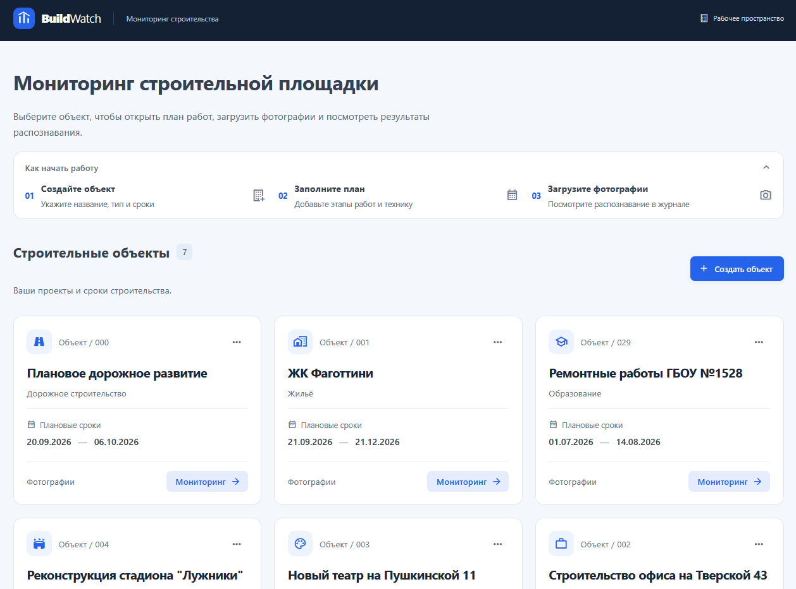

*Рисунок 1. Страница объектов*

Перечень объектов загружается автоматически. При прокрутке страницы система загружает следующие элементы списка.

---

## 2. Создание и редактирование объекта

### 2.1. Создание объекта

Для создания объекта необходимо:

1. Нажать «Создать объект».
2. Заполнить обязательные поля: название объекта, тип объекта, дату начала и дату окончания.
3. Нажать «Создать объект».

После создания объект отображается в перечне объектов, а пользователь переходит к его календарному плану для последующего формирования этапов.

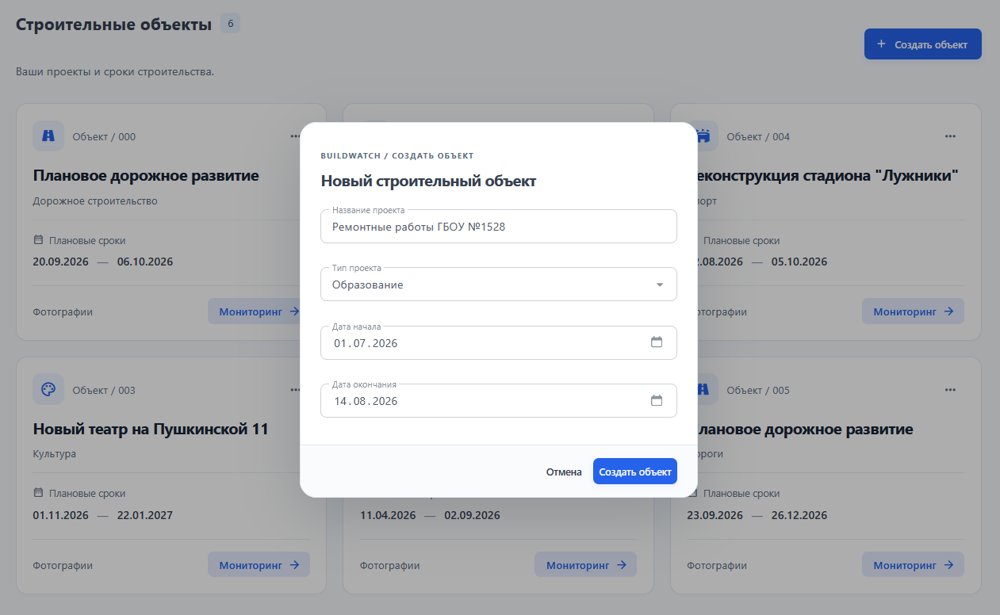

*Рисунок 2. Создание объекта*

При заполнении формы применяются следующие правила:

* название объекта является обязательным и должно содержать от 3 до 200 символов;
* тип объекта является обязательным и выбирается из справочника;
* дата окончания объекта не может предшествовать дате начала объекта.

### 2.2. Управление объектом

Управление объектом осуществляется из карточки объекта через меню «…».

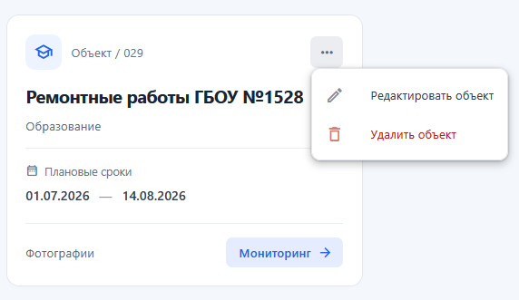

*Рисунок 3. Управление объектом*

| Действие                  | Порядок выполнения                                                | Результат                                                                                                         |
| ------------------------- | ----------------------------------------------------------------- | ----------------------------------------------------------------------------------------------------------------- |
| Открыть объект            | Нажать на название объекта или кнопку «Мониторинг»                | Открывается рабочее пространство объекта, включающее мониторинг, журнал наблюдений, календарный план и справочник |
| Открыть журнал наблюдений | Нажать «Фотографии» в нижней части карточки                       | Открывается журнал наблюдений объекта                                                                             |
| Редактировать объект      | Открыть меню «…» и выбрать «Редактировать объект»                 | Открывается форма редактирования с возможностью изменения названия, типа и сроков объекта                         |
| Удалить объект            | Открыть меню «…», выбрать «Удалить объект» и подтвердить действие | Объект удаляется из перечня вместе с календарным планом и наблюдениями                                            |

---

## 3. Рабочее пространство объекта

После открытия объекта в верхней части страницы отображаются название объекта и установленные для него сроки. В правой части отображается тип объекта. Навигация по разделам рабочего пространства расположена в левой части страницы.

В состав навигации входят следующие разделы:

* «Все объекты» — возврат к перечню объектов;
* «Мониторинг» — отображение текущего состояния объекта, выявленных отклонений и подтверждающих материалов;
* «Журнал наблюдений» — просмотр снимков строительной площадки и результатов распознавания техники;
* «Календарный план» — просмотр и управление этапами работ, сроками их выполнения и потребностью в строительной технике;
* «Справочник» — просмотр доступных видов работ и классов строительной техники.

---

## 4. Календарный план — основа мониторинга

После создания нового строительного объекта пользователь автоматически переходит к формированию календарного плана.

Календарный план является эталонными данными для мониторинга: система сопоставляет наблюдаемые на строительной площадке показатели с заданными в нём этапами работ, сроками их выполнения и требованиями к строительной технике.

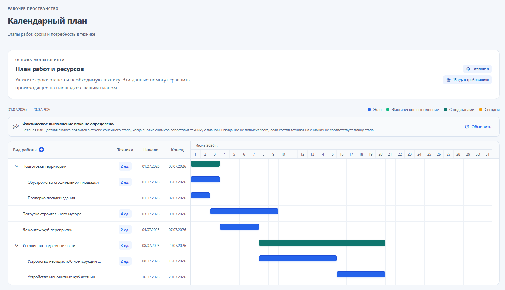

*Рисунок 4. Календарный план объекта*

| Элемент        | Описание                                                                                                                                                                                                                  |
| -------------- | ------------------------------------------------------------------------------------------------------------------------------------------------------------------------------------------------------------------------- |
| Таблица этапов | Содержит сведения о видах работ, строительной технике, датах начала и окончания этапов. Содержание родительских этапов может быть раскрыто или скрыто с помощью кнопки со стрелкой, расположенной слева от названия этапа |
| Диаграмма      | Отображает плановые интервалы выполнения этапов по дням. Синие полосы соответствуют отдельным этапам, зелёные — этапам, содержащим подэтапы. Столбец, выделенный светло-жёлтым цветом, обозначает текущую дату            |

---

## 5. Создание и редактирование этапа

### 5.1. Создание этапа

Для создания этапа необходимо:

1. Нажать «Добавить этап», кнопку «+» в заголовке таблицы «Вид работы» либо «Добавить подэтап» в строке соответствующего родительского этапа.
2. Выбрать вид работы из каталога объекта.
3. Указать дату начала и дату окончания этапа.
4. Добавить строительную технику с помощью кнопки «Добавить технику». Для каждой позиции необходимо выбрать класс техники и указать её количество.
5. Нажать «Сохранить».

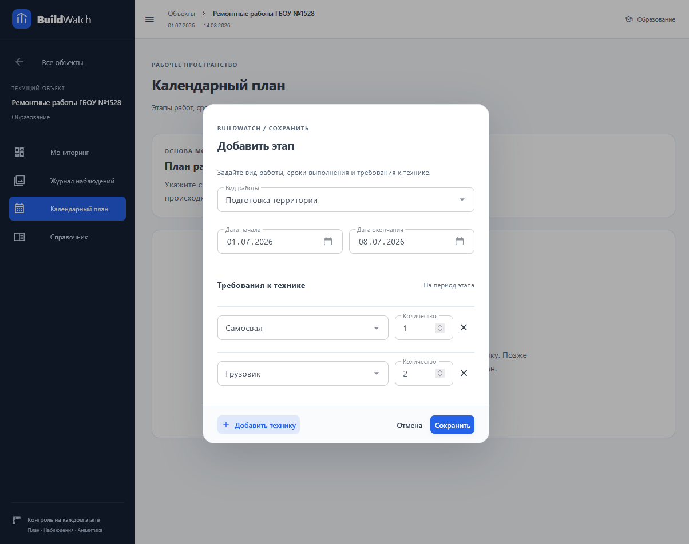

*Рисунок 5. Создание этапа*

При сохранении этапа система проверяет соблюдение следующих правил:

* вид работы является обязательным;
* даты подэтапа не могут выходить за пределы дат соответствующего родительского этапа;
* даты этапа не могут выходить за пределы периода выполнения объекта;
* дата окончания этапа не может предшествовать дате начала;
* пустые строки с указанием техники не учитываются;
* количество единиц техники должно быть не менее 1.

> **ПРИМЕЧАНИЕ**
>
> При создании подэтапа даты заполняются автоматически: датой начала устанавливается следующий день после окончания соседнего подэтапа в пределах соответствующего родительского этапа. При необходимости пользователь может изменить эти даты вручную.

### 5.2. Редактирование этапа

Для редактирования этапа необходимо:

1. Нажать на строку соответствующего этапа.
2. В открывшемся меню выбрать «Редактировать».
3. Изменить вид работы, сроки выполнения или состав строительной техники.
4. Нажать «Сохранить».

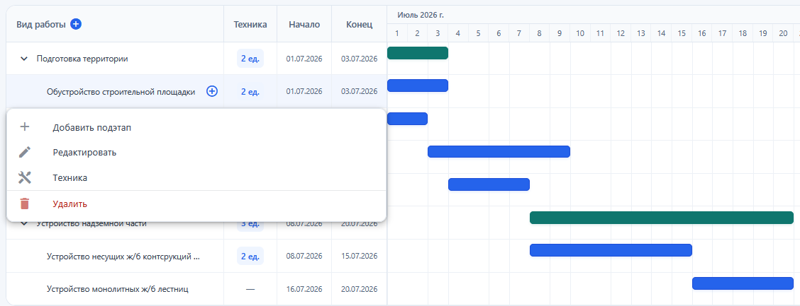

*Рисунок 6. Меню строки этапа*

Состав строительной техники может быть изменён отдельно без изменения сроков этапа. Для этого в меню строки этапа необходимо выбрать действие «Техника».

Удаление этапа выполняется через действие «Удалить» с последующим подтверждением. При удалении родительского этапа также удаляются относящиеся к нему подэтапы.

---

## 6. Справочник

Справочник предназначен для просмотра доступных типов объектов, классов строительной техники и видов работ, используемых при формировании календарного плана.

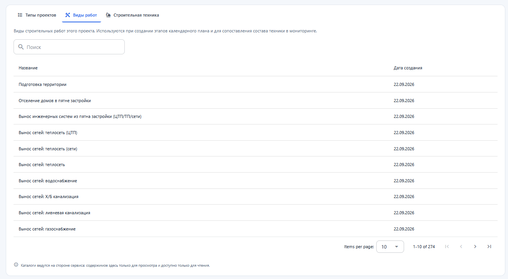

*Рисунок 7. Справочник, вкладка «Виды работ»*

| Элемент              | Описание                                                                                                                                                                                                                                                                |
| -------------------- | ----------------------------------------------------------------------------------------------------------------------------------------------------------------------------------------------------------------------------------------------------------------------- |
| Типы объектов        | Категории строительных объектов. Тип объекта выбирается при его создании                                                                                                                                                                                                |
| Виды работ           | Виды строительных работ, доступные для соответствующего объекта и используемые при формировании этапов календарного плана                                                                                                                                               |
| Строительная техника | Классы строительной техники, распознаваемые моделью. Наименование отображается в пользовательском интерфейсе, а системное обозначение используется в данных детекций. Классы техники могут быть указаны в составе этапов календарного плана и распознаваться на снимках |

Данные справочника загружаются постранично. Для поиска доступны наименования и системные обозначения элементов.

> **ПРИМЕЧАНИЕ**
>
> Данные справочника доступны только для просмотра и определяются на стороне сервера.

---

## 7. Загрузка снимков

Для загрузки снимков необходимо:

1. Нажать «Загрузить» в журнале наблюдений либо «Загрузить фотографии» в разделе мониторинга.
2. Перетащить файлы в область загрузки или выбрать их через системный диалог выбора файлов.
3. При необходимости указать дату снимка для каждого файла отдельно.
4. Нажать «Загрузить».

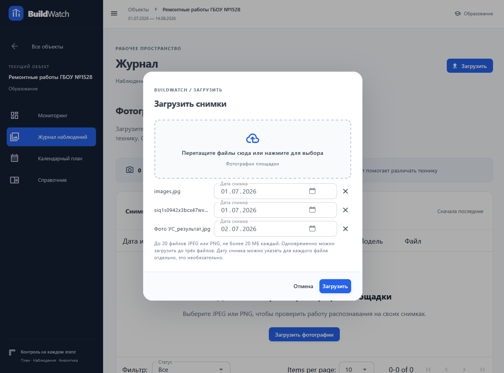

*Рисунок 8. Загрузка снимков*

При загрузке применяются следующие правила:

| Элемент           | Описание                                                                                                                                                         |
| ----------------- | ---------------------------------------------------------------------------------------------------------------------------------------------------------------- |
| Форматы файлов    | Поддерживаются форматы JPEG и PNG                                                                                                                                |
| Размер файла      | Размер одного файла не должен превышать 20 МБ. В рамках одной операции можно выбрать не более 20 файлов                                                          |
| Пакетная загрузка | Одновременно обрабатывается до трёх файлов. При превышении этого количества оставшиеся файлы загружаются последовательно                                         |
| Дата снимка       | Дата может быть указана отдельно для каждого файла. Указание даты необязательно, однако при её наличии она должна находиться в пределах периода действия объекта |

После отправки файлы последовательно получают следующие статусы: «В очереди», «Загрузка…», «Принят» или «Ошибка».

При возникновении ошибки окно загрузки остаётся открытым. Для файлов, обработка которых завершилась ошибкой, становится доступно действие «Повторить попытку».

> **ПРИМЕЧАНИЕ**
>
> Процесс загрузки не блокирует пользовательский интерфейс. Анализ запускается в фоновом режиме сразу после приёма файлов системой. Пользователь может перейти к календарному плану или разделу мониторинга; журнал наблюдений обновляется автоматически.

---

## 8. Журнал наблюдений

Журнал наблюдений содержит перечень всех загруженных в рамках объекта снимков. По умолчанию записи отображаются в порядке от наиболее новых к наиболее старым.

Статус обработки снимков обновляется автоматически без необходимости перезагрузки страницы.

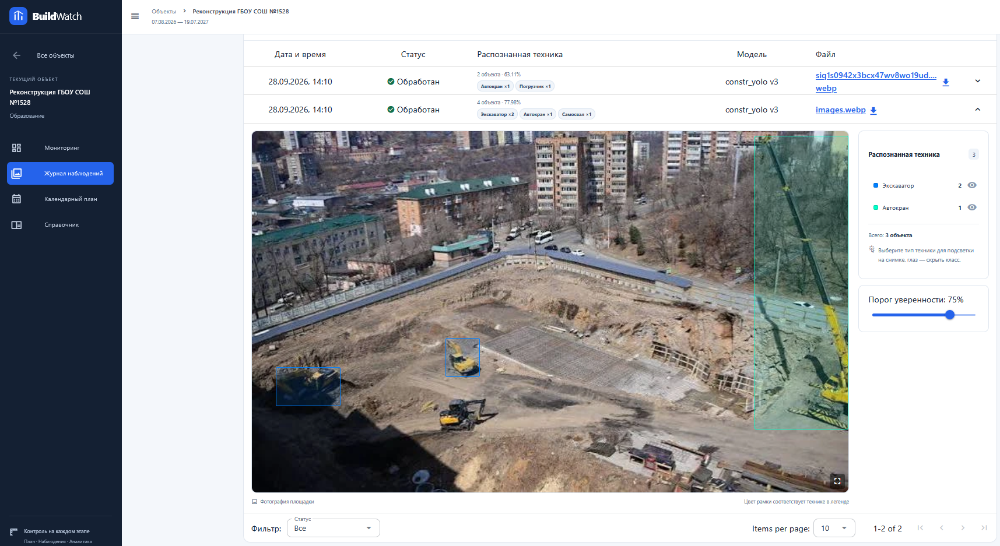

*Рисунок 9. Журнал наблюдений*

| Элемент                   | Описание                                                                                                                                           |
| ------------------------- | -------------------------------------------------------------------------------------------------------------------------------------------------- |
| Таблица «Снимки площадки» | Содержит дату и время снимка, статус обработки, сведения о распознанной технике, используемой модели и соответствующем файле                       |
| Фильтр по статусу         | Позволяет отображать снимки с выбранным статусом обработки                                                                                         |
| Раскрытие строки          | Кнопка со стрелкой в правой части строки открывает детальную информацию по результатам обработки соответствующего снимка непосредственно в таблице |

---

## 9. Проверка результатов распознавания техники

Раскрытая запись журнала наблюдений предоставляет возможность проверить результат распознавания строительной техники. На экране отображается исходный снимок с нанесёнными рамками детекции и перечень распознанной техники.

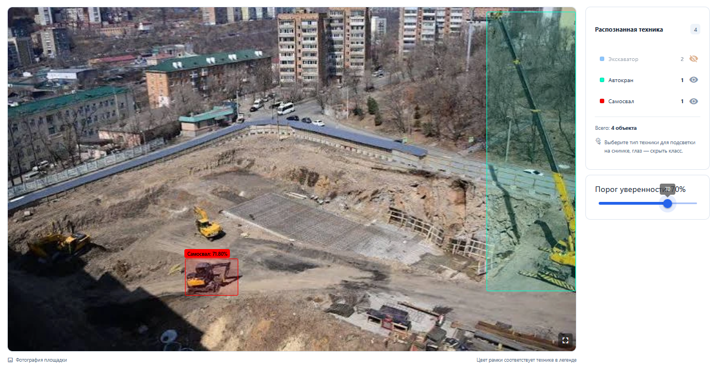

*Рисунок 10. Распознавание техники*

| Элемент                     | Описание                                                                                                                                                                                                                                                                                                            |
| --------------------------- | ------------------------------------------------------------------------------------------------------------------------------------------------------------------------------------------------------------------------------------------------------------------------------------------------------------------- |
| Снимок                      | Исходный снимок с нанесёнными рамками детекции. Цвет рамки соответствует классу техники в легенде. В правом нижнем углу расположена кнопка перехода в полноэкранный режим просмотра                                                                                                                                 |
| Список распознанной техники | Отображает общее количество распознанных объектов и перечень классов техники с указанием количества объектов каждого класса. При выборе класса техники на снимке отображаются только рамки детекции соответствующего класса. Кнопка с иконкой «Глаз» позволяет скрыть или показать рамки детекции выбранного класса |
| Ползунок порога уверенности | Позволяет установить минимальное значение уверенности модели, при котором результаты детекции отображаются на снимке. Изменение параметра влияет только на отображение рамок детекции                                                                                                                               |

После завершения обработки снимка система отображает на нём соответствующие рамки детекции, а в правой части интерфейса — перечень распознанной техники и элементы управления результатами детекции.

> **ПРИМЕЧАНИЕ**
>
> Для проверки результатов распознавания рекомендуется первоначально установить высокий порог уверенности и затем постепенно снижать его. Это позволяет последовательно оценить детекции с высокой и более низкой степенью уверенности.

---

## 10. Фактическое выполнение на диаграмме

После обработки снимков система отображает на диаграмме дополнительную полосу, отражающую фактическое выполнение этапов календарного плана на основании полученных наблюдений.

На диаграмме могут отображаться состояния отставания от плановых сроков и опережения плановых сроков.

Отставание обозначается оранжевой линией, опережение — голубой. При соответствии фактического выполнения плановым срокам линия отображается светло-зелёным цветом.

*Рисунок 11. Фактическое выполнение на диаграмме: отставание*

*Рисунок 12. Фактическое выполнение на диаграмме: опережение*

---

## 11. Мониторинг: суточная сводка

Раздел «Мониторинг» является основным экраном оперативной сводки по объекту. На нём отображаются текущий этап, сроки выполнения, выявленные отклонения и подтверждающие снимки за выбранную дату.

*Рисунок 13. Мониторинг*

| Элемент              | Описание                                                                                                                                                                                                              |
| -------------------- | --------------------------------------------------------------------------------------------------------------------------------------------------------------------------------------------------------------------- |
| «История наблюдений» | Календарь дат, по которым доступны наблюдения. Выбранная дата выделяется. Стрелки позволяют перейти к предыдущей или следующей дате. Легенда содержит состояния «По плану», «Опережение», «Отставание» и «Нет оценки» |
| Карточки показателей | Содержат сведения о фактическом этапе, сроках выполнения, выявленных отклонениях и качестве наблюдений                                                                                                                |

Суточные показатели представлены следующими карточками:

* «Фактический этап» — этап календарного плана, определённый системой на основании обработанных снимков и заданного календарного плана;
* «Сроки выполнения» — статус соответствия фактического выполнения плановым срокам этапа. Возможные значения: «По плану», «Отставание», «Опережение» или «Не определено» при недостаточности данных для определения статуса;
* «Отклонения» — количество выявленных отклонений относительно календарного плана;
* «Качество наблюдений» — характеристика объёма исходных данных и результатов их обработки за соответствующую дату, включая количество загруженных и успешно обработанных снимков.

---

## 12. Отклонения и подтверждения

### 12.1. Отклонения

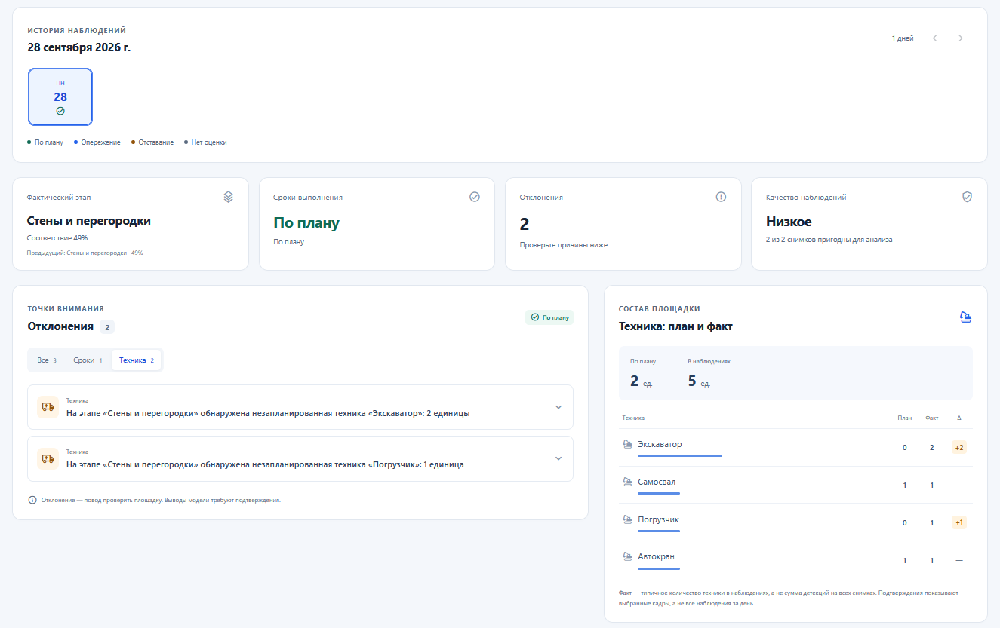

*Рисунок 14. Отклонения*

Для анализа отклонения необходимо:

1. Выбрать категорию отклонений: «Все», «Сроки» или «Техника». Для каждой категории отображается соответствующий счётчик.
2. Выбрать необходимое отклонение для раскрытия его подробной информации.
3. Ознакомиться с пояснением и сопоставлением плановых и наблюдаемых значений.
4. Нажать «Посмотреть подтверждения» для перехода к связанным подтверждающим снимкам.

Каждая карточка отклонения содержит его категорию, краткое описание, подробное пояснение и сопоставление плановых значений календарного плана с наблюдаемыми значениями.

В правой части раздела отображаются две информационные панели:

* «Техника: план и факт» — содержит итоговые значения по количеству строительной техники и детализацию по классам техники с указанием планового значения, фактического значения и разницы между ними;
* «Качество данных» — содержит сведения о количестве пригодных снимков, покрытии обработки и согласованности наблюдений, а также причины снижения качества данных либо сообщение о достаточности наблюдений.

### 12.2. Подтверждения

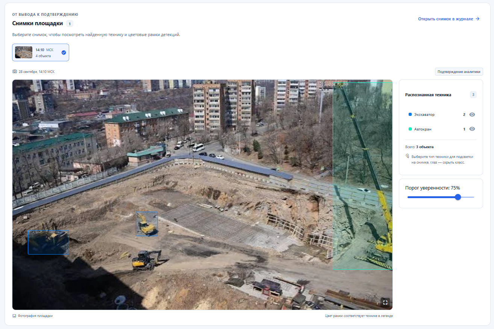

*Рисунок 15. Подтверждения*

Раздел «Снимки площадки» связывает вывод системы с исходными данными, на основании которых он сформирован.

В разделе отображаются:

* миниатюры подтверждающих снимков с указанием времени получения и количества распознанных объектов;
* выбранный снимок с отображением рамок детекции и панели «Распознанная техника» в правой части интерфейса.

Функциональность просмотра рамок детекции и перечня распознанной техники соответствует детальному просмотру результата обработки снимка в журнале наблюдений.

---

## 13. Ответственность пользователя

Система предоставляет инструментарий для анализа строительной площадки и не осуществляет принятие решений за пользователя. Функциональность системы включает распознавание строительной техники на снимках, формирование наблюдений, сопоставление наблюдений с календарным планом, выявление и визуализацию отклонений, а также предоставление подтверждающих снимков. Выводы системы являются результатом автоматизированной обработки данных и предназначены для последующей проверки пользователем.

Ответственность за принятие решений по результатам мониторинга несёт пользователь. На основании выводов системы пользователь самостоятельно определяет необходимость проведения дополнительной проверки строительной площадки, изменения состава или количества техники, корректировки сроков выполнения этапов либо внесения изменений в календарный план. Выявленное системой отклонение не является самостоятельным основанием для принятия решения и подлежит проверке по соответствующим подтверждающим материалам.
